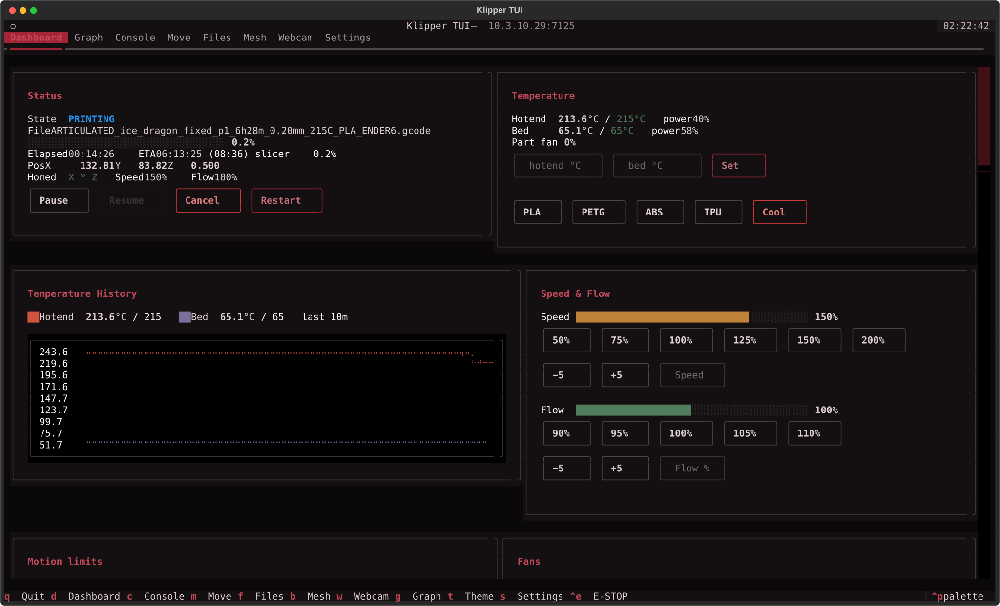
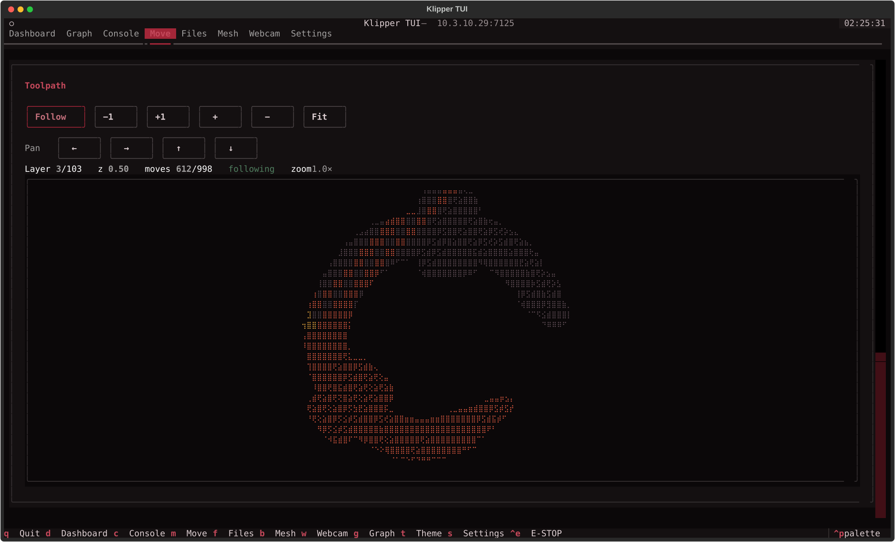
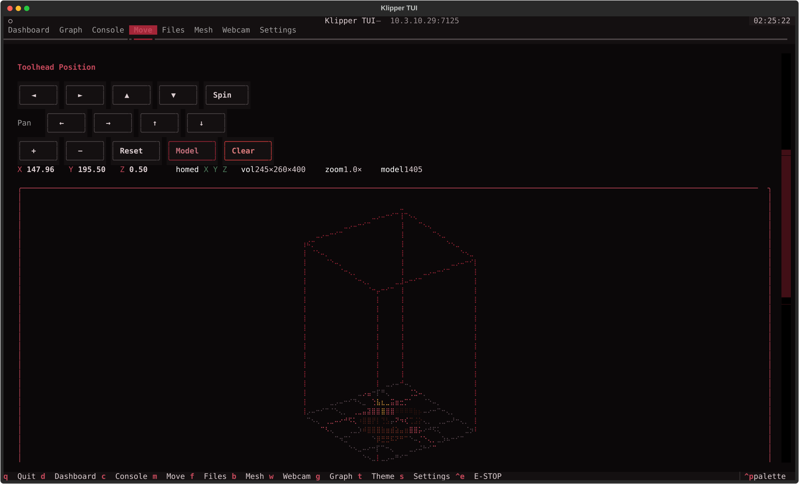
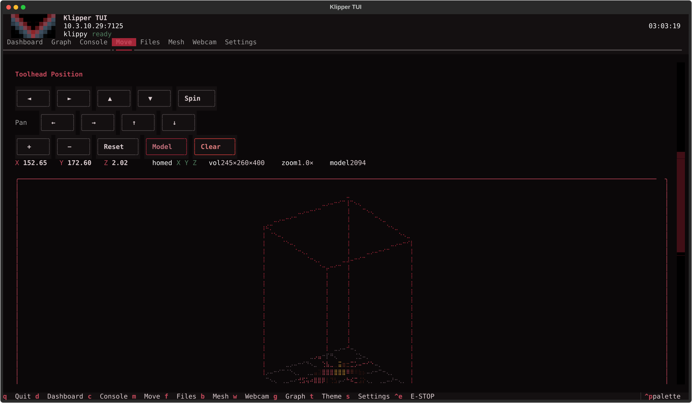
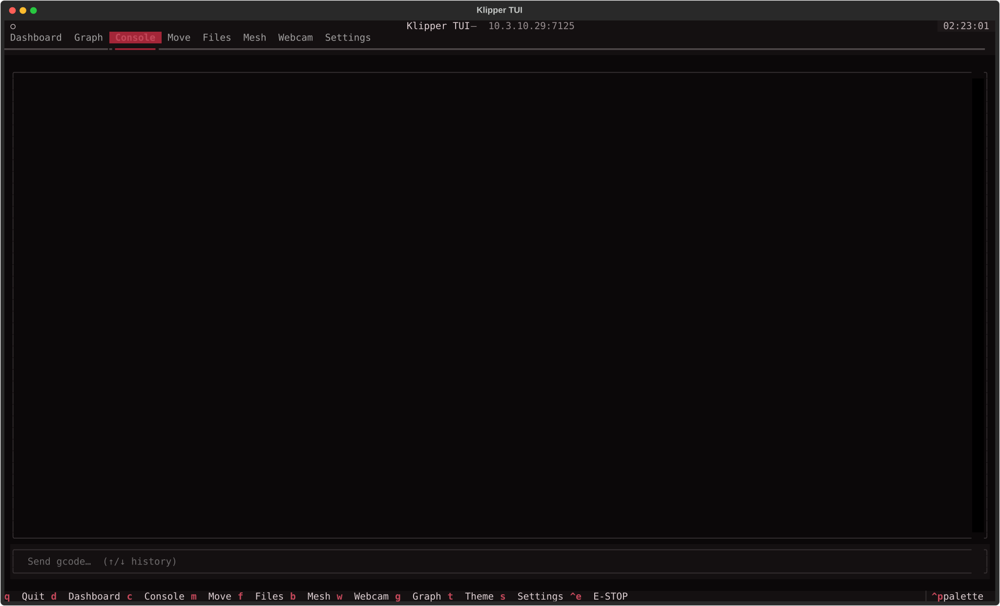
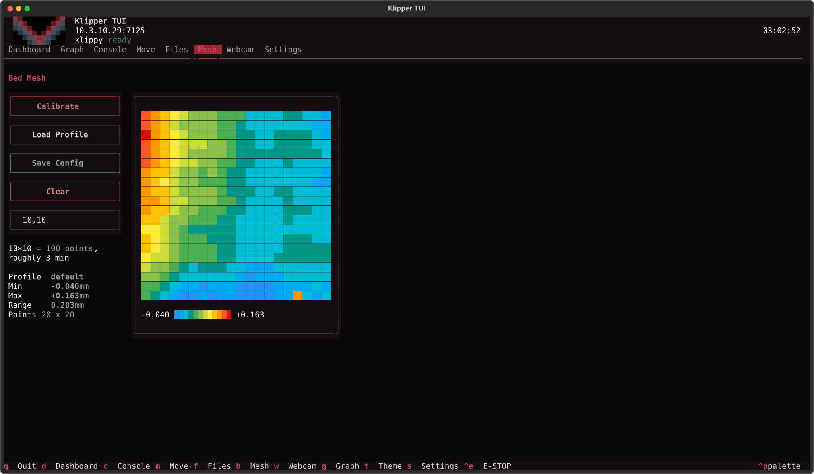
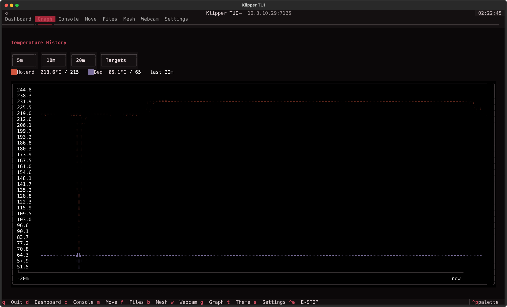
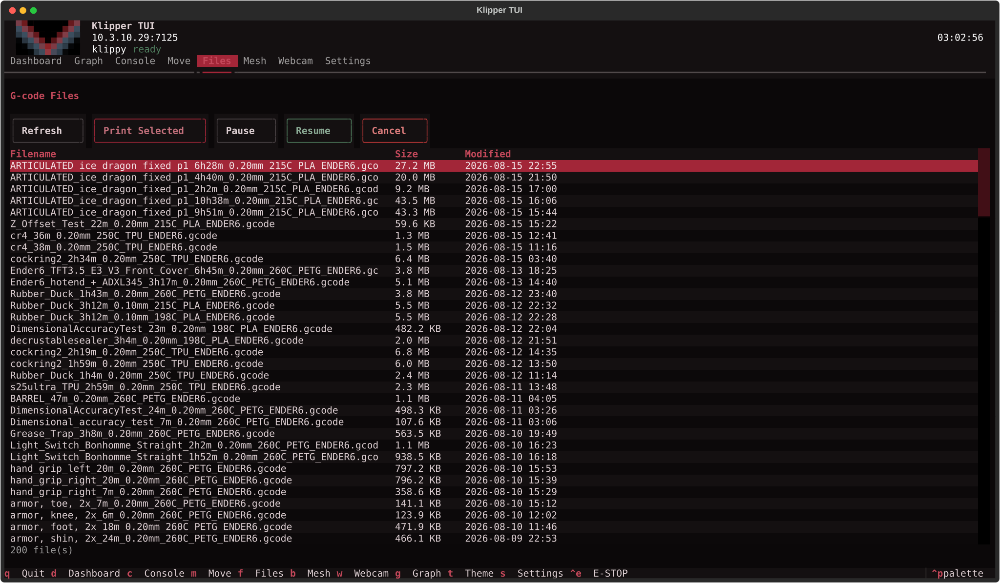

# klipper-tui

A terminal UI for Klipper 3D printers. It does most of what you would open
Mainsail or Fluidd for — watch temperatures, run a print, jog the toolhead,
send gcode, look at the bed mesh, check the webcam — without leaving the
terminal.

It talks to [Moonraker](https://moonraker.readthedocs.io/), the API server that
already runs alongside Klipper on your printer's host (usually a Raspberry Pi).
Moonraker is what Mainsail and Fluidd talk to as well, so if either of those
works in your browser, this will work too. Nothing is installed on the printer
itself; this is a client you run on your own machine.



**What you need**

- A printer running Klipper with Moonraker, reachable over the network.
- Its address — the same host you type into your browser for Mainsail, e.g.
  `mainsailos.local` or `192.168.1.50`.
- Python 3.10 or newer on the machine you run this from.

## Screenshots

Every one of these is a real session against a real printer, captured mid-print.

| | |
|---|---|
|  |  |
| **Toolpath** — the current layer as it is drawn, printed moves ahead of the nozzle in a different colour. | **Move** — homing, a jog cross, and live Z offset you can save into the probe. |
|  |  |
| **Toolhead position** — the build volume and the loaded model on the bed, rotatable. | **Console** — gcode in, printer responses out, with Tab completion. |
|  |  |
| **Bed mesh** — the probed heightmap, and a button to reprobe it. | **Temperature history** — the last ten minutes, hotend and bed. |
|  | |
| **Files** — sorted by date, double-click to print. | |

## Install

```bash
pipx install klipper-tui
```

Or from a checkout:

```bash
python3 -m venv .venv
.venv/bin/pip install -e .
```

## Run

```bash
.venv/bin/klipper-tui mainsailos.local
# or
KLIPPER_HOST=mainsailos.local .venv/bin/klipper-tui
```

Use `-p/--port` if Moonraker is not on 7125.

## Tabs

| Key | Tab | Contents |
| --- | --- | --- |
| `d` | Dashboard | Printer state, job progress, position, temperatures, presets, extruder |
| `c` | Console | Live gcode responses and a command input with `↑`/`↓` history |
| `m` | Move | Homing, jog controls, and a rotating 3D view of the build volume |
| `f` | Files | G-code browser — double-click a file to print it — plus pause/resume/cancel |
| `b` | Mesh | Bed mesh calibration and a colour heightmap |
| `w` | Webcam | Live MJPEG feed with pause and frame-rate control |
| `g` | Graph | Temperature history for hotend and bed, with target lines |
| `s` | Settings | Dashboard panels, presets, theme, webcam URL, restarts |

`Ctrl+E` sends an emergency stop. `t` cycles themes. `q` quits.

## Console

Type gcode, get the printer's replies. **Tab** completes the command name from
what the printer actually supports — the extended commands it reports, plus the
plain G and M codes — and completing an ambiguous prefix fills in as far as the
candidates agree and lists them. Up and down walk back through what you have
sent.

## Themes

Ships with `ominous` (default, dark with burgundy), `mainsail`, and `forge`,
plus a selection of Textual's built-ins. Choose one on the Settings tab, pass
`--theme`, press `t` to cycle, or use the command palette (`ctrl+p`). The
choice is saved.

Colours come from theme tokens rather than literals, so panels, charts, and
the 3D view all follow the active theme.

### Writing your own

Themes live in `klipper_tui/theming.py`. A theme is a Textual `Theme` plus a
`variables` dict carrying the colours specific to this app. Copy an existing
one and change the values:

```python
MIDNIGHT = Theme(
    name="midnight",
    dark=True,
    background="#080b12",   # furthest back: the screen
    surface="#111722",      # panel cards sit on this
    panel="#1a2130",        # button faces, borders derive from it
    primary="#2f5d8a",      # filled buttons, progress bars
    secondary="#24455f",
    accent="#4d8fc4",       # panel titles, active tab, focused input
    foreground="#d3dae6",   # body text
    success="#4a7c59",      # homed axes, "at temperature"
    warning="#c08238",      # unhomed, cold nozzle, paused
    error="#cf3b3b",        # errors, e-stop, disconnected
    variables={
        "hot": "#e0754f",       # extruder trace on the graph
        "hot-dim": "#6b3020",   # its target line
        "bed": "#6f9bd1",       # bed trace
        "bed-dim": "#2f4a6b",   # its target line
        "vol-frame": "#4d8fc4", # build volume wireframe
        "vol-floor": "#4a5468", # bed plane and grid
        "vol-head": "#e8c25a",  # toolhead marker
        "vol-drop": "#cf6b5a",  # drop line and floor crosshair
    },
)
```

Then add it to the registry near the bottom of the file:

```python
CUSTOM = {t.name: t for t in (OMINOUS, MAINSAIL, FORGE, MIDNIGHT)}
```

That is all — it appears on the Settings tab, in `--theme`, and in the `t`
cycle. To make it the default, set `DEFAULT_THEME = "midnight"`.

### Notes

The eight `variables` entries are required. A theme missing them will fail to
render the graph or the 3D view, which is why built-in Textual themes get them
backfilled from `NEUTRAL_DOMAIN` when they are registered.

Textual derives a large set of tokens from the ones above — `$panel-lighten-2`
for borders, `$text-muted` for labels, `$surface-darken-1` for the chart
background, and so on — so the eleven colours here style the whole app.

Pick `background`, `surface`, and `panel` as three steps of the same hue
rather than pure greys; the separation between them is what makes panels read
as cards. `accent` should be legible against `surface`, since panel titles use
it.

Two colours deliberately do **not** come from the theme. The bed mesh
heightmap uses a fixed blue→green→red gradient, because it encodes measured
values and needs to stay comparable between themes. The console resolves
colours to concrete hex at write time, because `RichLog` renders Rich markup
and cannot read `$token` styles.

## Time remaining

The ETA prefers the slicer's own estimate, taken from the file's metadata, and
shows the clock time the job should finish along with which source it used.
Extrapolating from how much of the file has been read is very wrong early on —
a six-hour print can sit under 1% for its first forty minutes — so that is only
a last resort, after filament used, and only once at least 2% is done.

## Mid-print safety

While a job is printing or paused, anything that would wreck it asks first:
homing, jogging, motors off, Z tilt, extruding by hand, loading filament,
probing the bed, changing motion limits, saving the config.

Everything you legitimately reach for during a print goes straight through —
temperatures, fans, speed and flow, babystepping the Z offset, and the job
controls themselves.

## Job control

Pause, Resume, Cancel, and Restart sit on the Status panel, so they are on the
dashboard by default. Each is enabled only when it applies — Resume is dead
while printing, Pause is dead while paused — rather than letting the printer
reject the command.

**Restart** cancels the running job, starts the same file again from the
beginning, and pauses it immediately, so you can clear the bed or get set up
before it lays anything down. It waits for the printer to actually stop before
restarting, since Klipper refuses a new job while one is unwinding.

## When the printer goes away

If Moonraker becomes unreachable, or Klipper shuts down or errors, an overlay
explains what happened and stays until the printer is ready again. It offers
Firmware Restart and Restart Klipper directly, which is usually what a
shutdown needs. Dismiss it with Escape if you want the UI back.

Both restarts are also on the Settings tab, behind a confirmation, since they
interrupt a running print.

## Cost

Only what is on screen is drawn. A panel in a tab you are not looking at does
no work — which matters, because the toolhead view, the toolpath and the webcam
are each expensive enough to saturate a core on their own.

Redraws are also throttled to twice a second, well under the rate Moonraker
pushes at; the bed mesh redraws only when the mesh has actually changed, and
the toolhead view starts still rather than spinning, since rotating it is the
single most expensive thing here.

## 3D view

The Move tab draws the build volume as a rotating wireframe with the toolhead
marked. `◄ ► ▲ ▼` rotate, `+ −` zoom, `← → ↑ ↓` pan, and Reset returns to the
default view. Spin pauses the automatic rotation.

**Model** builds up a picture of the print as it happens. Positions are sampled
from Klipper's motion report and a point is kept whenever the extruder axis has
advanced, so travel moves and retractions leave nothing behind. Points are
snapped to a 2mm grid and capped, which keeps a long print bounded; the model
resets when a different job starts, and Clear empties it by hand.

Material is shaded rather than drawn in one colour: brightness combines
distance from the viewer with height, which stands in for a light above and in
front, and only the nearest point per pixel is kept so nearer material hides
what is behind it. Without that the model is a flat blob with no readable
depth.

The model is saved as you go and restored when you reopen, so closing
klipper-tui mid-print does not lose what has been drawn. It is keyed to the
job, so a different print starts clean. Clear empties it by hand.

It is a coarse picture, not a gcode preview — the sample rate is whatever
Moonraker pushes, so fine detail is lost. It is enough to watch a part take
shape.

## Toolpath

The Move tab draws the current layer as the printer works through it: what has
been laid down so far in the material colour, what is still to come dimmed, and
the nozzle marked. Follow tracks the printer; `−1`/`+1` hold a layer and step
through it; `+`/`−` zoom and `← → ↑ ↓` pan, which is how you look at a corner
of a large part, and **clicking anywhere in the drawing centres it there**; Fit
reframes on the layer in view and undoes any zoom or pan. The 3D view works the
same way.

The gcode is fetched once per job and cached, then indexed to find where each
layer begins — only the layer being looked at is parsed, so a thirty-megabyte
print does not have to be held in memory. Drawing starts well before the
download finishes: everything printed so far is in the leading bytes, so the
current layer appears as soon as the transfer passes the print position, with
the rest filling in behind it. Which layer is showing comes from the
file position Klipper reports, so it matches the printer rather than guessing
from height. PrusaSlicer, SuperSlicer, and Cura layer markers are understood,
and a file with no markers is split on its Z moves.

Travel moves are left out. Drawing them buries the shape under straight lines
between features.

## Z offset

Live babystepping sits under the toolhead controls: nudge in 0.01 or 0.05mm
steps while a first layer goes down, and the current offset is shown alongside
the saved probe offset. Reset returns it to zero.

Save folds the live offset into the saved one — `Z_OFFSET_APPLY_PROBE`, or
`Z_OFFSET_APPLY_ENDSTOP` where there is no probe — and writes it with
SAVE_CONFIG. That restarts Klipper and stops any print, so it asks first.

## Fans

Every fan the printer reports gets a row on the dashboard, with its speed and
controls. Which fans exist is read from the printer rather than assumed, so a
second part fan, a board fan, or a chamber fan all appear on their own.

Alongside the presets each controllable fan has a field for any speed you
like — type a percentage and press Enter, or use Set.

How each is driven follows its type: the part cooling fan takes `M106`/`M107`,
a `fan_generic` takes `SET_FAN_SPEED`. Fans Klipper runs itself — `heater_fan`,
`controller_fan`, `temperature_fan` — are shown with their speed and marked
automatic, with no controls, because setting them by hand would just be
overridden.

## Macros

Every `[gcode_macro]` in your config gets a button, discovered from the printer
rather than configured here — so whatever you have written is already there.

Two kinds are left out. Macros whose name starts with an underscore are the
convention for helpers meant to be called by other macros rather than by a
person, and `PAUSE`, `RESUME` and `CANCEL_PRINT` are already the job control
buttons on the status panel.

Running a macro mid-print asks for confirmation first, since a macro can do
anything at all.

## Cancelling one object

If your config has `[exclude_object]` and the file was sliced with object
labelling turned on, the Objects panel lists what is on the plate and lets you
drop one that has failed while the rest carry on. This is the same
`EXCLUDE_OBJECT` that Mainsail's object map drives.

Without `[exclude_object]`, the panel says so instead of pretending. Adding it
is two lines in `printer.cfg`:

```ini
[exclude_object]
```

and, in Moonraker's `moonraker.conf`:

```ini
[file_manager]
enable_object_processing: True
```

The slicer has to label the objects too — in PrusaSlicer and OrcaSlicer this is
"Label objects" under Output options, set to *Firmware-specific*.

Cancelling an object cannot be undone, so it asks first.

## Motion limits

Velocity, square corner velocity, acceleration, and minimum cruise ratio sit on
the dashboard. They apply immediately with `SET_VELOCITY_LIMIT` and last until
the printer restarts; Reset puts back what `printer.cfg` says. The cruise ratio
is shown as a percentage, as Mainsail does, though Klipper carries it as a
fraction.

Like any panel it can be turned off on the Settings tab, which keeps the
restart controls.

## Jogging

X and Y are a cross rather than a row, laid out the way the axes point, so the
button you want is where the movement is. Z is the column beside it. Six
identical buttons in a line all look the same, and picking the wrong one moves
the printer.

The middle of the cross shows the current step size and cycles it — 0.1, 1, 10,
50mm — and the row underneath sets it directly.

## Levelling

A levelling button appears on the Toolhead panel only if your printer has
something to level, and says what it will do: **Z Tilt** for `[z_tilt]`,
**Quad Gantry** for `[quad_gantry_level]`, **Screw Tilt** for
`[screws_tilt_adjust]`. A bed-slinger with none of those does not get a button
for a command its firmware would only reject.

## After a cancelled print

When a running job is cancelled — from here, from Mainsail, or from the
printer's own screen — klipper-tui offers to turn the heaters off. It only asks
if a job was actually running and something is still hot, so a print that
finished normally, or one whose macro already cooled down, prompts nothing.

## After a restart

`SAVE_CONFIG`, `FIRMWARE_RESTART`, and a power cycle all clear the heater
targets and lose homing. When Klipper comes back, klipper-tui offers to restore
what was set before — heater targets and re-homing — and does nothing unless
you accept. Nothing is offered if the printer was already cold and unhomed.

## Settings file

Saved to `$XDG_CONFIG_HOME/klipper-tui/settings.json` (usually
`~/.config/klipper-tui/settings.json`). The dashboard, theme, and webcam URL
are written there by the UI. Two things are worth editing by hand:

```json
{
  "presets": {
    "PLA":  [215, 65],
    "PETG": [260, 80],
    "ABS":  [250, 90],
    "TPU":  [250, 80]
  },
  "filament_length": 1000
}
```

`presets` are the material buttons, as `[hotend, bed]` in °C. These are easier
to edit on the Settings tab, where adding or removing one updates the buttons
straight away; the file is only worth touching if you prefer it. The shipped
values are deliberately conservative, so set them to whatever your filament
actually wants.

`filament_length` is the default load/unload distance in mm. The default of
100 suits direct drive; for a bowden tube use roughly its length plus the
extruder path (1000 is typical).

## The header

The Klipper mark sits at the top left. On kitty and ghostty it is the real
image through the graphics protocol, on a sixel terminal it is sixel, and
anywhere else it falls back to half-blocks — which for a two-colour chevron
still reads fine. Beside it are the host you are connected to and what Klippy
currently thinks it is doing.

The logo belongs to the Klipper project. klipper-tui is an independent client
and is not affiliated with or endorsed by it, or by Mainsail.

## Bed mesh

Controls and numbers stack down the left with the heightmap beside them. A
heightmap is roughly square, so on its own row it would leave most of a wide
panel empty.


The probe count can be overridden per run from the Mesh tab — leave it blank
to use the value from `printer.cfg`, or enter `10` or `10,15`. The estimated
duration is shown as you type, which matters: a 100×100 grid is 10,000 probe
points and takes several hours.

If the axes are not homed, Calibrate offers to home first and starts probing
as soon as homing finishes, rather than failing with "Must home axis first".

The heightmap fills in point by point while probing. This does not depend on
the run being started here — open klipper-tui during a calibration, or start
one from Mainsail, and it joins the run in progress rather than showing the
previous mesh. Points probed before it joined are not shown, and it says so.
The display returns to the saved mesh once the run finishes, or if probing
stops without producing one.

Load Profile loads the mesh you actually have. If your config saved a single
profile under some name other than `default`, that is the one it loads; with
several, `default` wins if it exists and otherwise the first by name.

Klipper's own limits are checked before anything is sent — a minimum of 3 per
axis, `lagrange` cannot exceed 6, and `bicubic` needs at least 4 per axis. For
grids larger than 6, set `algorithm: bicubic` in your `[bed_mesh]` section.

## Dashboard

Any panel can be shown on the dashboard as well as on its own tab — toggle
them on the Settings tab. Panels are created and destroyed as you toggle, so
one that is switched off does no work. Settings are saved to
`$XDG_CONFIG_HOME/klipper-tui/settings.json`.

**The layout follows the width of the terminal.** Panels are packed side by
side as far as they will comfortably go, so a wide window shows two or three
across and a narrow one falls back to a single column. Each panel declares the
narrowest width it is still readable at, which decides both where the breaks
fall and how a shared row is divided — a panel needing half again as much as
its neighbour gets it, rather than an equal slice it would overflow. Resizing
the terminal reflows the whole thing.

## Webcam rendering

The webcam draws real images with
[textual-image](https://pypi.org/project/textual-image/). How good it looks
depends entirely on the terminal:

| Terminal | Best available | Flag |
| --- | --- | --- |
| xterm (`xterm -ti vt340`), konsole, foot, contour, mlterm, wezterm | true sixel | `--render sixel` |
| kitty, ghostty, wezterm | Kitty graphics protocol | `--render tgp` |
| gnome-terminal, most VTE terminals | unicode half-blocks | `--render halfcell` |

`--render auto` (the default) detects support and picks the best option.
**gnome-terminal has no sixel support**, so it falls back to half-blocks;
run under konsole or `xterm -ti vt340` for a true sixel image.

On kitty and ghostty the frame is sent as raw pixels rather than a PNG, which
is the difference between 38ms and 2ms of encoding for every frame — most of
what the camera costs. The tradeoff is bandwidth: raw is about 1.4MB a frame
against 600KB compressed, which is nothing down a pipe to a local terminal and
rude over a slow link, so it turns itself off when the session is over ssh. Set
`KLIPPER_TUI_RAW_TGP=1` to force it on anyway, or `=0` to always send PNGs.

### Pointing it at your camera

The webcam tab asks your printer for one still image at a time and redraws it,
so it needs a URL that returns **a single JPEG** each time it is fetched — a
"snapshot" URL. It is not a video stream.

By default it tries:

```
http://<your-printer-host>/webcam/?action=snapshot
```

which is where MainsailOS and FluiddPi put it. If your camera shows up in
Mainsail, that address is usually already correct and you do not need to change
anything.

**If the tab shows a 404 or a connection error**, set the URL on the Settings
tab (`s`) — type it in, press Apply, and it is saved for next time. You can
also pass `--webcam-url`, or set `$KLIPPER_WEBCAM_URL`. Reset returns to the
default.

**Finding the right URL.** In Mainsail, go to Settings → Webcams and look at
the configured camera; the "Snapshot URL" field there is exactly what this
wants. Failing that, these are the common ones — try each in a browser, and use
whichever shows a still photo:

| Setup | Snapshot URL |
| --- | --- |
| MainsailOS / FluiddPi (default) | `http://HOST/webcam/?action=snapshot` |
| Second camera on the same host | `http://HOST/webcam2/?action=snapshot` |
| mjpg-streamer on its own port | `http://HOST:8080/?action=snapshot` |
| crowsnest / ustreamer | `http://HOST/webcam/snapshot` |
| Generic IP camera | often `http://HOST/snapshot.jpg` or `/jpg/image.jpg` |

Replace `HOST` with your printer's address. A URL ending in `action=stream` is
the *video* feed — this app wants `action=snapshot` instead.

**A camera bound to localhost.** Some setups run the camera server listening on
`127.0.0.1` only, so it is reachable from the printer but not from your desktop.
Those work in Mainsail because a proxy on the printer forwards `/webcam/` to it.
Use the proxied `http://HOST/webcam/?action=snapshot` form rather than the
port-specific one in that case.

**Frames are scaled to what the widget can show before being drawn**, and PNGs
are encoded for speed rather than size. A 720p frame otherwise costs about
400ms to encode — a few frames a second saturated a core on their own.

**The stream stops while the tab is hidden.** A 720p feed is the heaviest thing
here, and pulling it for a tab nobody is looking at starves everything else. It
picks up again when the tab comes back.

**Frame rate** is set with the buttons on the tab. Frames come from the
camera's MJPEG stream, which pushes continuously, so there is no per-frame
request; the number shown is what is actually being decoded, against the cap
you asked for. If the stream cannot be reached it falls back to fetching
snapshots and says so.

### Getting more out of the camera

Most Klipper images run the camera far below what it can do. Check what yours
is actually configured for:

```bash
pgrep -a mjpg_streamer          # look for -r and -f
v4l2-ctl --list-formats-ext -d /dev/video0   # what the camera supports
```

A common default is `-r 640x480 -f 10` on a camera capable of far more. On
MainsailOS/OctoPi, set it in `/boot/firmware/octopi.txt`:

```
camera_usb_options="-r 1280x720 -f 30"
```

then `sudo systemctl restart webcamd`. Higher resolution is worth it in a
terminal that draws real images (kitty, or sixel), less so where it falls back
to unicode blocks. Bandwidth is the limit — if the delivered rate drops, step
the resolution back down.

## Notes

- Jog and extrude commands are wrapped as `G91 … G90` and `M83 … M82`. Klipper keeps
  absolute/relative mode as persistent state, so a jog that errors out mid-script can
  otherwise leave the printer in relative mode and break the next print.
- Extrude, retract, and load/unload are blocked below `min_extrude_temp` (170°C), which
  Klipper would reject anyway.
- Load/unload use the printer's own `LOAD_FILAMENT` / `UNLOAD_FILAMENT` macros when they
  exist, and fall back to a plain relative extrude move when they do not.
- The mesh panel falls back to displaying a *saved* profile when no mesh is currently
  loaded, and labels it as inactive so a saved-but-unloaded mesh is not mistaken for
  an applied one.
